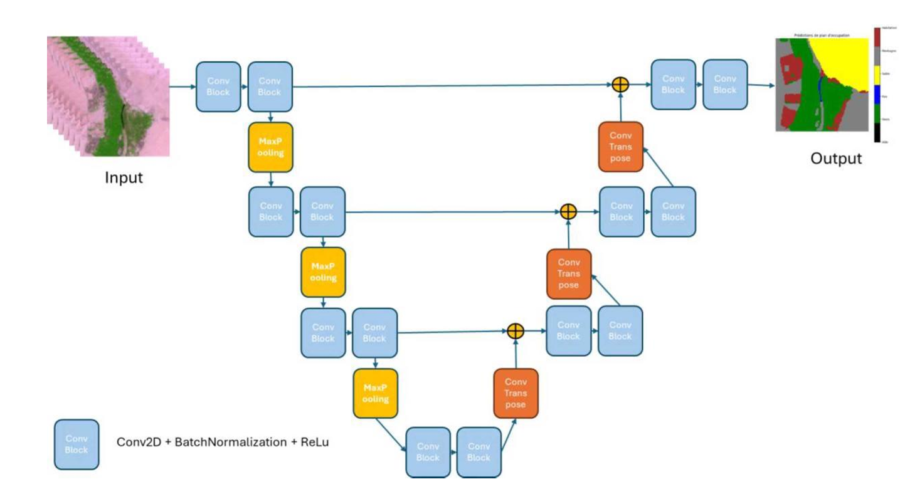
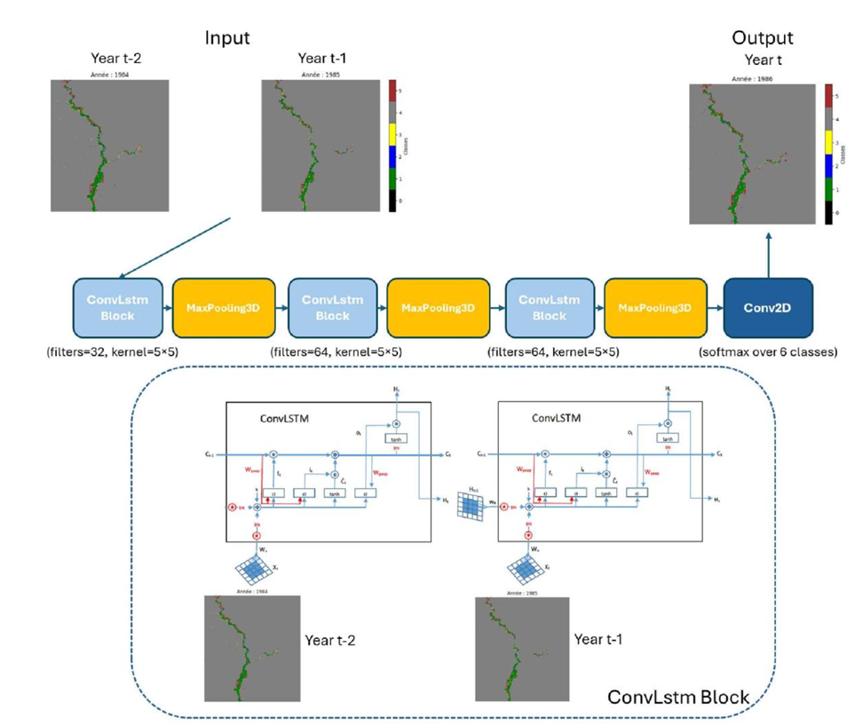

# Tafilalet Oasis: Deep Learning & Big Data for Land Monitoring
Ce projet est le résultat d'un travail de fin d'études de Master IA & Big Data. Il vise à surveiller l'évolution de l'oasis du Tafilalet (Maroc) en utilisant des techniques de Computer Vision et de Deep Learning pour lutter contre les enjeux climatiques.
## Résumé du Projet
L'oasis du Tafilalet est un écosystème fragile. Ce projet propose une approche double pour l'analyse environnementale :
1.  **Segmentation Sémantique (U-Net)** : Classification de l'occupation du sol pour identifier les zones de palmeraies, les zones urbaines et les sols nus, les habitations, les points d'eau.
2.  **Prédiction Temporelle (ConvLSTM)** : Modélisation de l'évolution future du terrain basée sur des séries temporelles d'images satellites.
## Architecture des modèles

  
   
  <i>Architecture du modèle U-Net pour la segmentation de l'oasis.</i>

  
   
  <i>Architecture du modèle CONVLSTM pour la prédiction de l'oasis.</i>

## Stack Technique
*   **Langage** : Python (Jupyter Notebooks)
*   **Deep Learning** : TensorFlow / Keras
*   **SIG** : QGIS pour le prétraitement des données spatiales.
*   **Modèles** :
    *   `U-Net` pour l'extraction de masques.
    *   `ConvLSTM` pour la prévision spatio-temporelle.
*   **Bibliothèques** : fichier requirements.txt
## Équipe & Encadrement
Projet réalisé par une équipe de 5 étudiants sous la direction de 2 professeurs (Master IA & Big Data).
*   **Étudiants** : Paul Renardier , Mathis Ehkirch, Soma Kouyate, Darly Junior Nguema, Emmanuel Bibang.
*   **Superviseurs** : Badr-Eddine Benelmostafa, Sohaid Baroud.
## Licence

Ce projet est sous licence **Creative Commons Attribution - Pas d'Utilisation Commerciale - Partage dans les Mêmes Conditions 4.0 International (CC BY-NC-SA 4.0)**.

Vous êtes libre de :
*   **Partager** — copier et redistribuer le matériel sous n'importe quel format.
*   **Adapter** — remixer, transformer et transformer le matériel.

Selon les conditions suivantes :
*   **Attribution** — Vous devez créditer le travail, fournir un lien vers la licence et indiquer si des modifications ont été effectuées.
*   **Pas d’Utilisation Commerciale** — Vous n'êtes pas autorisé à faire un usage commercial de ce matériel ou de toute partie de celui-ci.
*   **Partage dans les Mêmes Conditions** — Si vous modifiez le matériel, vous devez diffuser vos contributions sous la même licence que l'original.

L'intégralité du texte juridique est consultable ici : [CC BY-NC-SA 4.0 International](http://creativecommons.org/licenses/by-nc-sa/4.0/).
